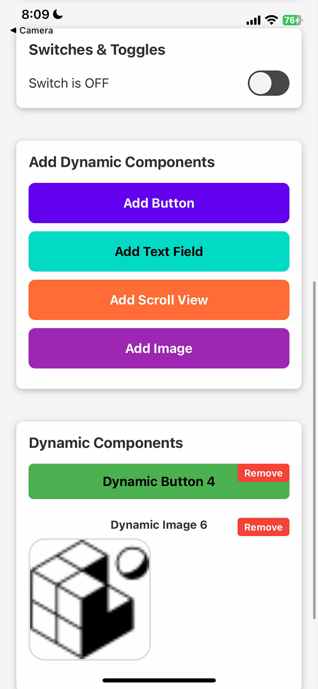

# Component Showcase App

A React Native/Expo application that demonstrates dynamic component management and showcases various UI components with the ability to add, display, and remove components interactively.

## Features

### Static Components
- **Buttons**: Primary, Secondary, and Disabled button styles
- **Text Fields**: Single-line and multiline text inputs
- **Switches & Toggles**: Interactive switch components

### Dynamic Components
- **Add Buttons**: Create interactive buttons that show alerts
- **Add Text Fields**: Generate single-line and multiline text inputs
- **Add Scroll Views**: Create horizontal and vertical scrollable content
- **Add Images**: Display images from various sources (remote and local)

### Interactive Features
- Dynamic component management with state tracking
- Individual component removal functionality
- Real-time component counter in footer
- Mixed image sources (Picsum photos, placeholder images, local assets)

## Screenshots



*The above screenshot shows the app's "Add Dynamic Components" section with controls for adding different component types, and the "Dynamic Components" section displaying an added button and image.*

## Installation

1. Clone the repository:
```bash
git clone https://github.com/rjkent14/my-expo-app.git
cd my-expo-app
```

2. Install dependencies:
```bash
npm install
```

3. Start the development server:
```bash
npx expo start
```

## Usage

1. **View Static Components**: The app displays example buttons, text fields, and switches at the top
2. **Add Dynamic Components**: Use the colored buttons in the "Add Dynamic Components" section:
   - **Add Button** (Blue): Creates interactive buttons
   - **Add Text Field** (Teal): Creates text input fields
   - **Add Scroll View** (Orange): Creates scrollable content areas
   - **Add Image** (Purple): Adds images from various sources
3. **Manage Components**: Each dynamic component has a "Remove" button for easy deletion
4. **Monitor Count**: The footer shows the total number of dynamically added components

## Component Types

### Buttons
- Alert dialogs when pressed
- Alternating color schemes (blue/green)
- Individual removal capability

### Text Fields
- Single-line and multiline variants
- Placeholder text indication
- Clean, modern styling

### Scroll Views
- Horizontal and vertical orientations
- Sample content with numbered items
- Configurable scroll indicators

### Images
- Multiple source types:
  - Random images from Picsum Photos
  - Custom placeholder images
  - Local project assets
- Three size variations (small, medium, large)
- Rounded corners for larger images

## Technology Stack

- **React Native**: Cross-platform mobile development
- **Expo**: Development platform and build tools
- **JavaScript**: Modern ES6+ syntax

## Project Structure

```
my-expo-app/
├── App.js              # Main application component
├── app.json           # Expo configuration
├── package.json       # Dependencies and scripts
├── assets/           # Image assets
│   ├── icon.png
│   ├── favicon.png
│   ├── adaptive-icon.png
│   └── splash-icon.png
└── README.md         # Project documentation
```

## Contributing

1. Fork the repository
2. Create a feature branch (`git checkout -b feature/amazing-feature`)
3. Commit your changes (`git commit -m 'Add some amazing feature'`)
4. Push to the branch (`git push origin feature/amazing-feature`)
5. Open a Pull Request

## License

This project is open source and available under the [MIT License](LICENSE).